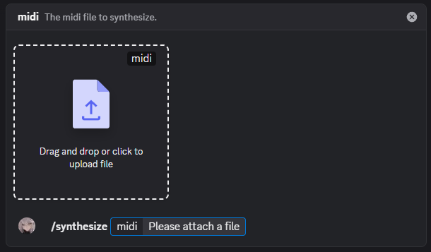
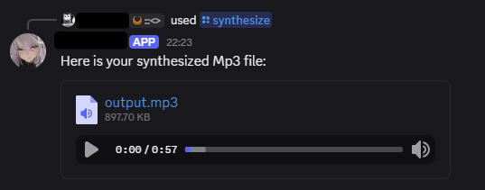

# midimprev

midimprev is a Discord bot designed for musicians and hobbyists to share MIDI melodies easily. Instead of downloading and synthesizing MIDI files locally, users can generate MP3 previews directly within Discord.

Built with TypeScript, powered by the Bun runtime, and utilizing high-performance MIDI synthesis.

> I am just getting this out the door after being in the pipeline for a year. The reason for it's existence no longer exists, just want to get this off my plate.

## Features

- [x] **Instant MIDI Synthesis**: Convert .mid attachments to MP3s.
- [x] **SoundFont (SF2) Support**: Use custom SoundFonts for instrument sounds.
- [ ] **Instrument Exploration**: List available instruments from your configured SoundFont.
- [x] **Docker Support**: Containerized for easier self-hosting.
- [x] **Performance**: Leverages [midirave](https://github.com/wsand02/midirave) and [nami3](https://github.com/wsand02/nami3) for processing.
- [x] **Configurable subprocess timeouts**

## Prerequisites

Before you begin, ensure you have the following installed:
- Bun (if running locally)
- Docker & Docker Compose (recommended for deployment)
- A SoundFont (.sf2) file (e.g., FluidR3_GM.sf2 or Touhou.sf2)

## Installation

### Permissions
> [!NOTE]
> You might be able to get by with lesser permissions, but these are the ones I used during development.


### Using Docker (Recommended)

1. **Clone the repository:**
```bash
git clone https://github.com/wsand02/midimprev.git
cd midimprev
```

2. **Configure your environment:**
Copy docker-compose.yml.example to docker-compose.yml and fill in the environment variables.

3. **Deploy commands**
```bash
docker compose run --build --rm bot --skipLogin --deployGlobal
```

4. **Deploy with Docker Compose:**
```bash
docker-compose up -d --build
```

### Manual Installation (Local Development)

> [!NOTE]
> Manual installation requires midirave (version v0.1.0-pasta) and nami3 to be compiled and available in your system path.

1. **Install dependencies:**
```bash
bun install
```

2. **Deploy commands:**
```bash
bun run src/index.ts --deployGlobal --skipLogin
```

3. **Run the bot:**
```bash
bun run src/index.ts
```

## Environment Variables

The bot requires the following environment variables to function:

- `DISCORD_TOKEN`: Your Discord Bot Token
- `DISCORD_CLIENT_ID`: Your Bot's Application ID
- `DISCORD_GUILD_ID`: (Optional) The ID of the server for server specific command deployment
- `SF2_PATH`: Path to your SoundFont file (e.g., /sf2/Touhou.sf2 or /sf2/FluidR3_GM.sf2)
- `SUBPROCESS_TIMEOUT`: (Optional) Timeout for synthesis subprocesses in minutes (default: 2)

## Launch Flags
`--purgeGlobal [commandId]` Deletes a specific command globally.
`--purgeGuild` Deletes all commands from the configured GUILD_ID.
`--deployGlobal` Deploys all commands globally.
`--deployGuild` Deploys all commands to the configured GUILD_ID.
`--skipLogin` For running flags without launching the bot.

## Bot Commands

### MIDI Previewing
- **`/synthesize [attachment]`**
  - **Description**: Synthesizes a provided MIDI file into an MP3.
  - **Usage**: Upload a .mid file and run the command.

 

- **`/instruments`**
  - **Description**: Lists instruments available in the configured SoundFont.
  - **Note**: This is currently a developer utility is currently disabled.

### Utility
- **`/ping`**: Pong.
- **`/server`**: Displays information about the current server.
- **`/user`**: Displays information about the user.

## Project Structure

- `src/bot.ts`: Core bot logic and command registration.
- `src/commands/`: Individual slash command implementations.
- `src/proc/`: Wrapper for external synthesis processes (midirave, nami3).
- `sf2/`: Recommended directory for storing SoundFont files.

## Limitations

- Requires specific external binaries ([midirave](https://github.com/wsand02/midirave) and [nami3](https://github.com/wsand02/nami3)) for synthesis.
- Designed primarily for self-hosting.
- Lacks any form of rate limiting.

## License

This project is licensed under the MIT License. See the [LICENSE](LICENSE) file for details.
